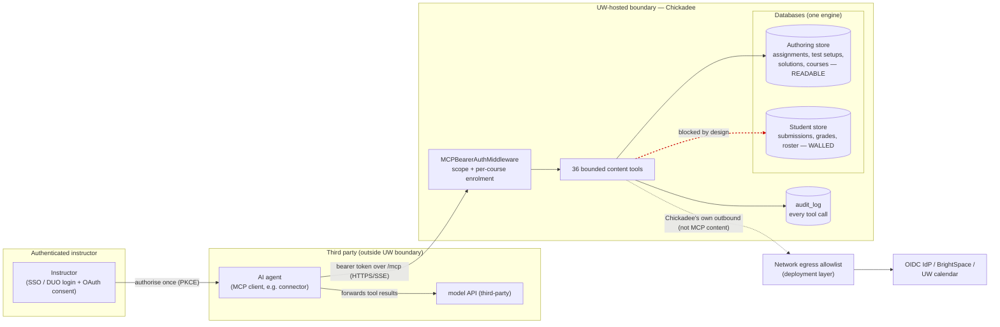

# MCP Trust Boundary

A short architecture note for the IRA submission, plus the figure to attach.

## Where the boundary actually sits

Chickadee runs the MCP **server**; it does not embed or call any AI model. An
authenticated instructor first authorises an external agent (the Claude
connector) through Chickadee's own OAuth 2.1 flow (Authorization Code + PKCE).
The agent then connects to the bearer-gated `/mcp` endpoint and invokes
content-authoring tools. The agent — not Chickadee — is what talks to a
third-party model API, **outside** Chickadee's process and outside the
UW-hosted trust boundary.

So the controls that matter for this submission are:

1. **The inbound gate** — who may connect (`MCPBearerAuthMiddleware`) and what
   they may do (per-tool scope + per-course enrolment check).
2. **The bounded tool surface** — 36 special-purpose tools, no general escape
   hatch (`tool-inventory.md`).
3. **The student-data wall** — tools read the authoring store and the
   instructor's own validation runs, never student submissions/grades/roster.
4. **What each tool returns** — because the return value is exactly what the
   agent can forward to its model (`data-flow-inventory.md`).

There is **no** Chickadee→model-API egress edge to allowlist; the model API is
reached by the agent. Chickadee's own outbound edges (OIDC/DUO, BrightSpace/D2L,
UW calendar, optional alert webhook) carry no MCP content and should be
restricted at the network layer (see `ira-audit-report.md` §5).

## Figure

The external model node is shown connected to the **agent**, not to Chickadee,
to reflect the real data path. The external node is labelled generically; the
provider is named only in prose (the Claude connector / Anthropic API).

Legend:
- Solid arrow into the boundary = authenticated, scoped, audited request.
- Red dashed arrow `T ⇢ SS` = the student store the MCP surface must not reach.
  This is the wall whose enforcement is the P0 remediation item.
- `A → M` = the only path to a model API, and it lives entirely with the agent.

## Verifiable claims behind the figure

| Claim | Evidence |
|-------|----------|
| `/mcp` is bearer-gated | `MCPServerRegistration.swift:125-126` (route mounted behind `MCPBearerAuthMiddleware`) |
| Per-course enrolment enforced per request | `ToolContext.swift:67-77`; `CourseAccessHelpers.swift:35-40` |
| Every tool call is audited | `MCPDispatcher.swift:208`, `:226-236` |
| MCP makes no model-API call | no outbound HTTP under `Sources/APIServer/MCP/`; no model client in `Package.swift` |
| Authoring vs student stores | model census in `data-flow-inventory.md` |
| Wall is by-convention today | `ToolContext.db == request.db` (`ToolContext.swift:35`) — same connection as the rest of the app |
